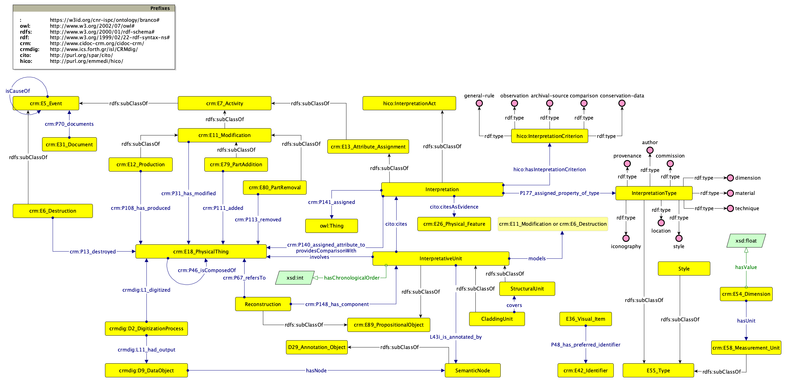

# Brancacci Chapel Ontology

Repository hosting the OWL Ontology describing cultural site reconstruction through [Extended Matrix](https://www.extendedmatrix.org/) applied to the Brancacci Chapel.

`PREFIX: https://w3id.org/cnr-ispc/ontology/branco#`

The ontology directly reuses [CIDOC-CMR](https://www.cidoc-crm.org/html/cidoc_crm_v7.1.3.html), [CRM-DIG](https://ontome.net/namespace/211), and [HICO](https://marilenadaquino.github.io/hico/#d4e318):

