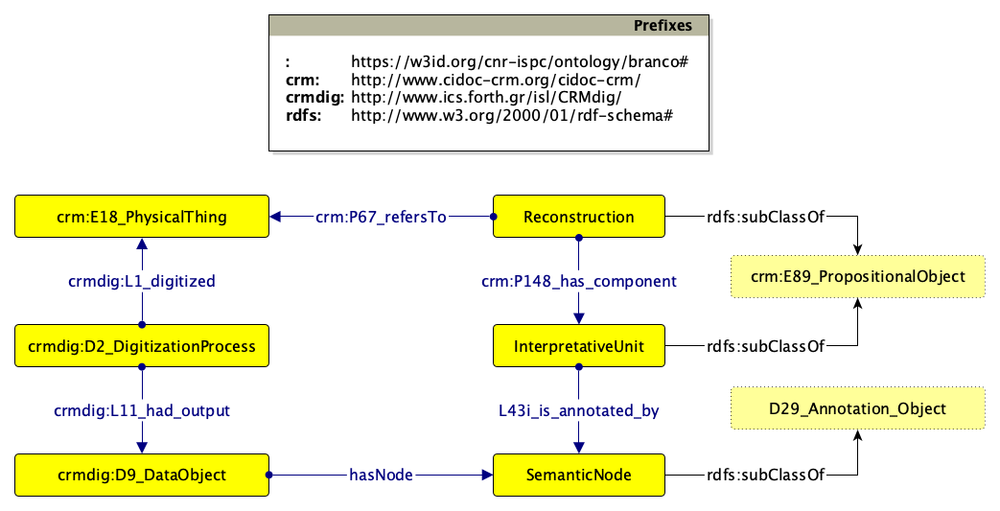

The first modelet can be aligned with [CIDOC-CRM](https://www.cidoc-crm.org/html/cidoc_crm_v7.1.3.html) (v. 7.1.3) and [CRMDig](https://www.cidoc-crm.org/crmdig/ModelVersion/version-3.2.1) (v. 3.2.1)

The resulting ontological model can be visualised as:



Please note that the SPARQL Queries should be rewritten as follows

```
PREFIX : <https://w3id.org/cnr-ispc/ontology/branco#>
PREFIX crm: <http://www.cidoc-crm.org/cidoc-crm/>
PREFIX crmdig: <http://www.ics.forth.gr/isl/CRMdig/>
```

1. `SELECT ?campaign WHERE {?campaign crmdig:L1_digitized :domus-a}`
2. `SELECT ?3dmodel WHERE {?campaign crmdig:L1_digitized :domus-a. ?campaign crmdig:L11_had_output ?3dmodel.}`
3. `SELECT ?us WHERE {?reconstruction crm:P67_refers_to :domus-a. ?reconstruction crm:P148_has_component ?us} ORDER BY ?us`
4. `SELECT ?us ?semanticNode WHERE {?digitzation crmdig:L1_digitized :domus-a. ?digitzation crmdig:L11_had_output ?3dmodel. ?3dmodel :hasNode ?semanticNode. ?us crmdig:L43i_is_annotated_by ?semanticNode } ORDER BY ?us`
