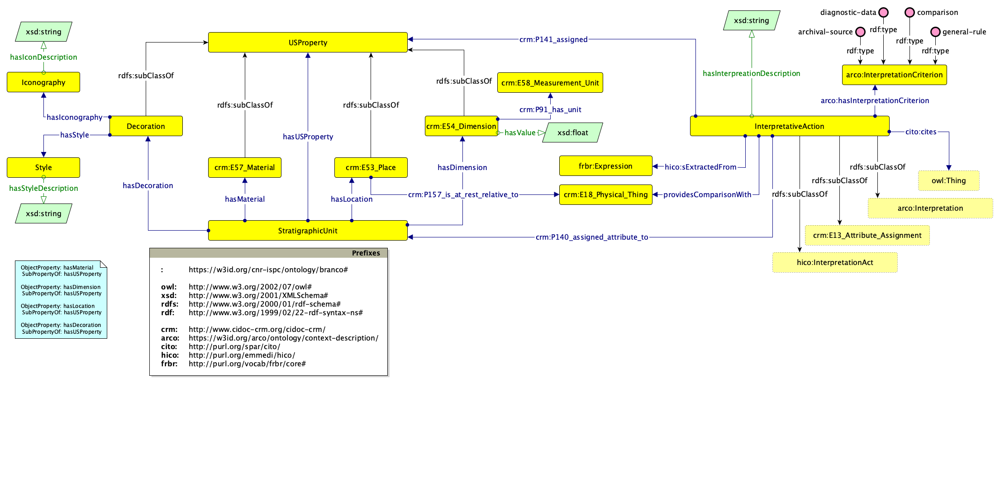

The third modelet can be aligned with [CIDOC-CRM](https://www.cidoc-crm.org/html/cidoc_crm_v7.1.3.html) (v. 7.1.3), [CiTO](https://sparontologies.github.io/cito/current/cito.html) (v. 2.8.1) and [Context Description Ontology (ArCo network)](http://wit.istc.cnr.it/arco/lode/extract?url=https://raw.githubusercontent.com/ICCD-MiBACT/ArCo/master/ArCo-release/ontologie/context-description/context-description.owl) (v. 2.0.0)

The resulting ontological model can be visualised as:



To run the queries of the three scenario, please declare the following prefixes:

```
PREFIX : <https://w3id.org/cnr-ispc/ontology/branco#>
PREFIX cito: <http://purl.org/spar/cito/>
PREFIX crm: <http://www.cidoc-crm.org/cidoc-crm/>
PREFIX crmdig: <http://www.ics.forth.gr/isl/CRMdig/>
PREFIX arco: <https://w3id.org/arco/ontology/context-description/>
PREFIX rdfs: <http://www.w3.org/2000/01/rdf-schema#>
PREFIX xsd: <http://www.w3.org/2001/XMLSchema#>
```

1. `SELECT ?locatedObj ?criterion ?citedObj WHERE { ?interpretation crm:P140_assigned_attribute_to :us-domus-b-atrium-venus . ?interpretation crm:P141_assigned ?location . ?location a :Placement . ?location crm:P157_is_at_rest_relative_to ?locatedObj . ?interpretation arco:hasInterpretationCriterion ?criterion OPTIONAL {?interpretation :providesComparisonWith ?citedObj} }`
2. `SELECT DISTINCT ?description ?criterion ?comparedObj ?citedObj WHERE { ?interpretation crm:P140_assigned_attribute_to ?us . ?us a  :StratigraphicUnit. ?interpretation arco:hasInterpretationCriterion ?criterion . ?interpretation :hasInterpretationDescription ?description OPTIONAL {?interpretation :providesComparisonWith ?comparedObj}  OPTIONAL {?interpretation cito:cites ?citedObj}}`
3. `SELECT DISTINCT * WHERE { ?interpretation crm:P140_assigned_attribute_to :us-domus-b-westwall . ?interpretation crm:P141_assigned ?decoration . ?decoration a :Decoration . ?interpretation arco:hasInterpretationCriterion ?criterion . ?interpretation :hasInterpretationDescription ?description . OPTIONAL {?decoration :hasStyle ?style .} OPTIONAL { ?decoration :hasIconography ?icon}}`
4. `SELECT ?dimension ?val ?unit WHERE { :us-domus-b-westwall :hasDimension ?dimension. ?dimension  :hasValue ?val . ?dimension crm:P91_has_unit ?unit}`