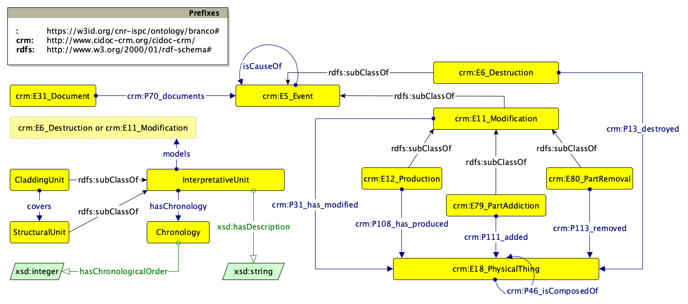

The second modelet can be aligned with [CIDOC-CRM](https://www.cidoc-crm.org/html/cidoc_crm_v7.1.3.html) (v. 7.1.3)

The resulting ontological model can be visualised as:

No particular change should be implemented in the SPARQL Queries (yet, if necessary, replace `:Event` with `crm:E5_Event`)