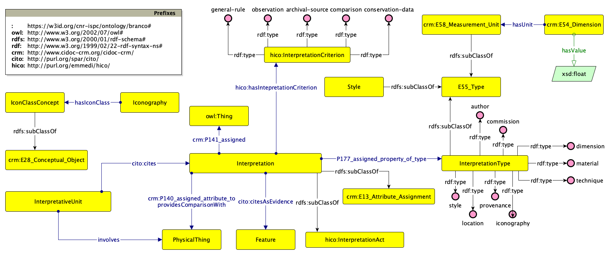

The third modelet can be aligned with [CIDOC-CRM](https://www.cidoc-crm.org/html/cidoc_crm_v7.1.3.html) (v. 7.1.3) and [HICO](https://marilenadaquino.github.io/hico/#d4e318) (v. 2.0.0)

The resulting ontological model can be visualised as:



To run the queries of the three scenario, please declare the following prefixes:

```
PREFIX : <https://w3id.org/cnr-ispc/ontology/branco#>
PREFIX cito: <http://purl.org/spar/cito/>
PREFIX crm: <http://www.cidoc-crm.org/cidoc-crm/>
PREFIX crmdig: <http://www.ics.forth.gr/isl/CRMdig/>
PREFIX hico: <http://purl.org/emmedi/hico/>
PREFIX rdfs: <http://www.w3.org/2000/01/rdf-schema#>
PREFIX xsd: <http://www.w3.org/2001/XMLSchema#>
```

1. `SELECT ?criterion WHERE { :intunit-c1 cito:cites ?int . ?int hico:hasInterpretationCriterion ?criterion}`
2. `SELECT ?val ?unit WHERE { :intunit-c1 cito:cites ?int . ?int crm:P141_assigned ?dim. ?dim a crm:E54_Dimension. ?dim :hasValue ?val . ?dim crm:P91_has_unit ?unit}`
3. `SELECT ?icon ?criterion ?artwork WHERE { :intunit-c2 cito:cites ?int . ?int crm:P141_assigned ?icon . ?int hico:hasInterpretationCriterion ?criterion OPTIONAL {?int :providesComparisonWith ?artwork}}`